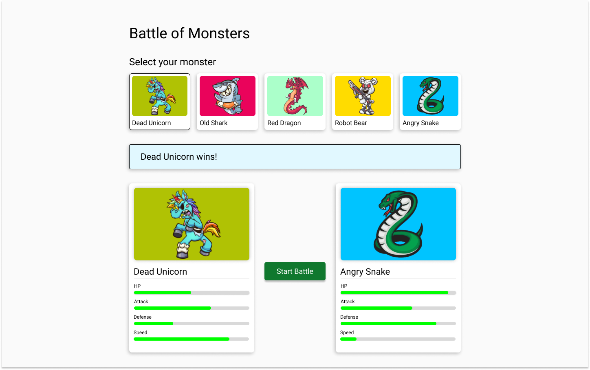

# Node/React Coding Challenge - Battle of Monsters
Full stack application on Node / Express and React to simulate a battle of monsters between the user and the CPU


You can find the solution to this challenge on the `solution` branch.

## Technologies

This project is built using the Node and React ecosystem libraries; it is good you know the following items to have a good performance:

- [Typescript](https://www.typescriptlang.org/)
- [Express](https://expressjs.com/)
- [Objection.js](https://vincit.github.io/objection.js/)
- [Knex.js](http://knexjs.org/)
- [Jest](https://jestjs.io/)
- [React](https://reactjs.org/docs/getting-started.html)
- [Redux](https://redux-toolkit.js.org/introduction/getting-started)
- [Material UI](https://mui.com/material-ui/getting-started/usage/)
- [Jest Fetch Mock](https://www.npmjs.com/package/jest-fetch-mock)
- [React testing Library](https://testing-library.com/docs/react-testing-library/intro/)

## The Coding Challenge - Backend

The app is a battle of monsters, where we have many different monsters with different stats like attack and defense, for example, and we can let them fight each other.

**Goals**

- Implement missing functionalities: endpoints to list all monsters and start a battle.
- Work on tests marked with `TODO`.
- Ensure the code style check script passes.

**Important Considerations**

- Do NOT modify already created tests. If the code is implemented correctly, these tests should pass without modifications.
- You will face some issues in making the app run, this is part of the challenge, and we expect that you can fix them.

### Battle Algorithm

For calculating the battle algorithm,  take into account the flow below:

- The monster with the highest speed makes the first attack, if both speeds are equal, the monster with the higher attack goes first.
- For calculating the damage, subtract the defense from the attack `(attack - defense)`; the difference is the damage; if the attack is equal to or lower than the defense, the damage is 1.
- Subtract the damage from the HP `(HP = HP - damage)`.
- Monsters will battle in turns until one wins; all turns should be calculated in the same request; for that reason, the battle endpoint should return winner data in just one call.
- Who wins the battle is the monster who subtracted the enemy’s HP to zero.

### Project **Set Up**

1. Clone repository on your terminal

```bash
git clone https://github.com/jorgegmezdev/battle-of-mosnters-node-react.git
```

2. Enter to api folder
3. Use nvm to [install](https://github.com/nvm-sh/nvm#usage) and use the Node version on the API project

```bash
nvm install x.x.x
nvm use x.x.x
```

4. Copy .env.example to .env

```bash
cp .env.example .env
```

5. Install packages

```bash
npm install
```

6. Database migrations and seeds

```bash
npm run db:setup
```

### Acceptance Criteria

1. All monster endpoints were implemented and working correctly.
2. All battle endpoints were implemented and working correctly.
3. Failing old tests should pass.
4. All `TODO` tests were implemented successfully.
5. Test code coverage should be at least 80%, and you must run it and show it to us during the recording.
6. The code style check script must pass on completion of the challenge without any modifications to the config.

## The Coding Challenge - Fronted

The current application displays a list of monsters. We only have the feature of selecting the player's monsters; your job is to implement the missing functionalities.

**Goals**

- Create the monster's card component to visualize the monster's strengths and weaknesses correctly.
- Implement the logic to get the computer's monster which should be randomly selected after the player's monster is selected, not allowing it to be the same one as the player; remember that you will select the player's monster by clicking on it.
- Once both monsters are selected, the user can “Start Battle," and you must implement the service request and display the battle result correctly.

**Important Considerations**

- It is not necessary to create a responsive application for different devices; you can focus only on the web version.

### API

To establish a connection with the API, you will need to initiate the project found in the API folder within the same repository. As this is a Full-Stack challenge, it is your responsibility to integrate the frontend with the API, so you will need to check if the endpoints are in the correct response or even if the frontend is calling the endpoints correctly; it is your responsibility to integrate both apps.

The endpoints frontend will need from the API are the following:

- `GET /monsters`: Return all the needed info for the monster's list.
- `POST /battle`: Receive a body and return the battle's result.

### Project **Set Up**

1. Enter to front-end folder
2. Use nvm to [install](https://github.com/nvm-sh/nvm#usage) and use the Node version on the Fronted project

```bash
nvm install x.x.x
nvm use x.x.x
```

1. Install packages

```bash
npm install
```

### Design



### Acceptance Criteria

1. Implementation matches the design.
2. The computer monster is randomly selected after selecting the player monster.
3. The winner's message should be presented after the battle.
4. Tests pass, and coverage has been added to cover the changes and new implementations.

